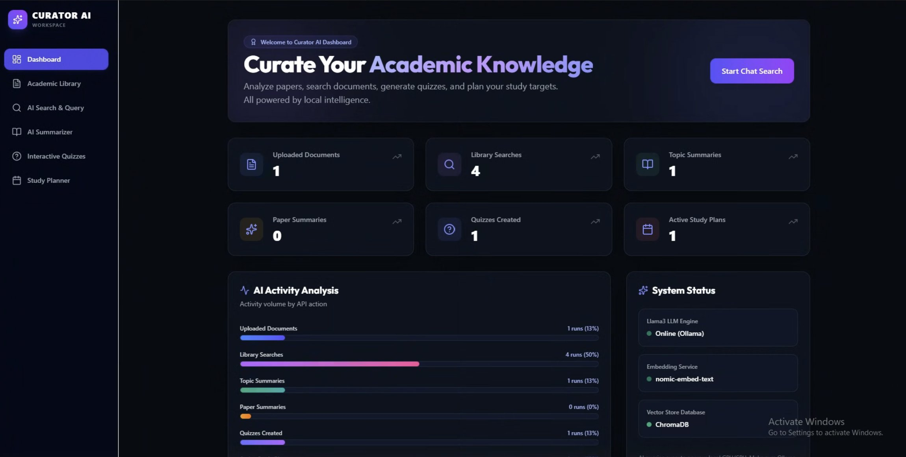

<div align="center">



<br/><br/>

# 🎓 Curator AI

### Intelligent Academic Assistant — Powered by Local AI

**Curate your academic knowledge. Search documents, generate quizzes, summarize papers, and plan your studies — all running locally on your machine.**

[](https://fastapi.tiangolo.com/)
[](https://react.dev/)
[](https://vitejs.dev/)
[](https://tailwindcss.com/)
[](https://www.trychroma.com/)
[](https://ollama.com/)
[](LICENSE)

</div>

---

## 📖 Project Description

Curator AI is a fully **local, privacy-first** academic assistant built for university students. It ingests your course PDFs — textbooks, lecture slides, and solution manuals — extracts semantic knowledge using PDF parsing and OCR, and stores everything in a local ChromaDB vector database.

Through a clean React dashboard, you can search your entire curriculum in natural language, generate AI-curated quizzes and assignments, summarize papers instantly, and build structured study plans — all powered by a locally running **Llama3** model via Ollama.

> 🔒 **No cloud. No subscriptions. No data ever leaves your machine.**

---

## ✨ Features

- 📥 **PDF Ingestion** — Upload textbooks and lecture notes; auto-extracts text with OCR fallback for scanned documents
- 🔍 **Semantic Search** — Ask questions in natural language; retrieves the most relevant content from your knowledge base
- 📝 **Assignment Generator** — Generates and downloads professionally formatted PDF assignments on any topic
- 🧪 **Interactive Quizzes** — Creates 5 MCQs + 5 study flashcards from any subject in your library
- 📄 **AI Summarizer** — Summarizes specific PDFs or any general topic into clean bullet-point notes
- 📅 **Study Planner** — Builds a milestone-based study timeline and logs it to a local SQLite database
- 📊 **Activity Dashboard** — Visual overview of API usage, system status (Llama3, ChromaDB, embeddings), and study progress

---

## 🛠️ Tech Stack

| Layer                | Technology                                    |
| -------------------- | --------------------------------------------- |
| **Backend API**      | FastAPI + Uvicorn                             |
| **Frontend**         | React 18, Vite, Tailwind CSS v4, Lucide Icons |
| **Vector Database**  | ChromaDB                                      |
| **Language Model**   | Ollama — `llama3`                             |
| **Embeddings**       | Ollama — `nomic-embed-text`                   |
| **PDF Processing**   | pdfplumber + pytesseract (OCR)                |
| **PDF Generation**   | ReportLab                                     |
| **Activity Logging** | SQLite                                        |
| **Text Processing**  | LangChain                                     |

---

## ⚙️ Installation

### Prerequisites

Before you begin, ensure you have the following installed:

- [Python 3.10+](https://www.python.org/downloads/)
- [Node.js 18+](https://nodejs.org/)
- [Ollama](https://ollama.com/) — local LLM runtime
- [Tesseract OCR](https://github.com/UB-Mannheim/tesseract/wiki) — required for scanned PDF processing

### Step 1 — Pull Ollama Models

```bash
ollama pull llama3
ollama pull nomic-embed-text
```

### Step 2 — Clone the Repository

```bash
git clone https://github.com/yourusername/curator-ai.git
cd curator-ai
```

### Step 3 — Set Up Python Backend

```bash
# Create virtual environment
python -m venv .venv

# Activate (Windows PowerShell)
.venv\Scripts\Activate.ps1

# Activate (Windows CMD)
.venv\Scripts\activate.bat

# Install dependencies
pip install -r requirements.txt
```

### Step 4 — Set Up React Frontend

```bash
cd frontend
npm install
```

---

## 🚀 Usage

### 1. Start Ollama (if not already running)

```bash
ollama serve
```

### 2. Start the FastAPI Backend

```bash
# From project root
.\.venv\Scripts\python.exe -m uvicorn main:app --reload
```

> API is now live at **http://localhost:8000**

### 3. Start the React Frontend

```bash
# From /frontend directory
npm run dev
```

> Dashboard is now live at **http://localhost:5173**

### 4. Verify Configuration

```bash
python check_config.py
```

### 5. Upload Your First PDF

Go to **Academic Library** in the sidebar → click **Upload Document** → select any course PDF. The system will extract, chunk, embed, and index it automatically.

---

## 📁 Project Structure

```
curator-ai/
├── main.py                      # FastAPI entrypoint — all API routes
├── config.py                    # Centralized path & database configuration
├── check_config.py              # Environment verification script
├── requirements.txt             # Python backend dependencies
├── curator_data.db              # SQLite — activity logs & study plans
│
├── src/
│   ├── ingestor.py              # PDF parsing, OCR, and text chunking
│   ├── retriever.py             # Similarity search + Llama3 response engine
│   ├── llm_gateway.py           # Ollama LLM & embedding interface wrappers
│   └── db_manager.py           # SQLite helpers for logs and study plans
│
├── dl_models/
│   └── handwriting_gen.py       # ReportLab PDF assignment generator
│
├── data/
│   ├── academic/                # Successfully ingested PDFs (active knowledge base)
│   └── rejected/                # Scanned/image-only PDFs (pending DL-OCR upgrade)
│
├── multimodal_db/               # ChromaDB persistent vector storage
│   └── chroma.sqlite3
│
└── frontend/
    ├── src/
    │   ├── components/          # Dashboard, Library, Search, Quiz, StudyPlan panels
    │   ├── App.jsx              # Root layout, sidebar navigation, routing
    │   └── index.css            # Tailwind CSS v4 + Google Fonts
    ├── vite.config.js           # Vite config + port 8000 reverse proxy
    └── package.json             # Frontend Node.js dependencies
```

---

## 🔧 Configuration

All backend paths are managed in `config.py`:

```python
# config.py
DATA_ACADEMIC = "data/academic"      # Ingested PDFs live here
DATA_REJECTED = "data/rejected"      # Failed/scanned PDFs
DB_PATH       = "multimodal_db"      # ChromaDB vector store location
```

The frontend Vite proxy is configured in `frontend/vite.config.js` to forward all `/api` requests to `http://localhost:8000`.

**Environment assumptions:**

- Ollama must be running on `http://localhost:11434`
- Tesseract must be installed and added to your system PATH

---

## 🔌 API Reference

### Core Endpoints

| Method | Endpoint                    | Body / Params                            | Description                                  |
| ------ | --------------------------- | ---------------------------------------- | -------------------------------------------- |
| `GET`  | `/`                         | —                                        | Health check → `{"status": "online"}`        |
| `POST` | `/upload`                   | `file` (multipart)                       | Ingest a PDF into the academic library       |
| `GET`  | `/search`                   | `question` (str), `request_notes` (bool) | Semantic search with Llama3 curated response |
| `POST` | `/summarize`                | `topic` (form)                           | Bullet-point summary of any topic            |
| `POST` | `/summarize-specific-paper` | `filename` (form)                        | Summarize a specific indexed PDF             |
| `POST` | `/generate-quiz`            | `topic` (form)                           | Generate 5 MCQs + 5 flashcards               |
| `POST` | `/generate-assignment`      | `question` (form)                        | Download a formatted PDF assignment          |
| `POST` | `/create-study-plan`        | `topic`, `due_date` (form)               | Generate and log a milestone study plan      |
| `GET`  | `/dashboard-stats`          | —                                        | Activity logs for dashboard charts           |
| `GET`  | `/documents`                | —                                        | List all indexed PDFs in knowledge base      |
| `GET`  | `/study-plans`              | —                                        | List all active study plans                  |

### Example Request

```bash
curl "http://localhost:8000/search?question=Explain+binary+search+trees&request_notes=false"
```

```json
{
  "answer": "A binary search tree (BST) is a node-based data structure where each node's left child is smaller and right child is larger...",
  "sources": ["2101_DSA_ALL(Faculty_Lecture).pdf"]
}
```

---

## 📸 Screenshots

### Dashboard Overview


_The main dashboard shows document counts, search activity, AI analysis charts, and live system status for Llama3, ChromaDB, and the embedding service._

---

## 🤝 Contributing

Contributions are welcome! Here's how to get started:

1. **Fork** the repository
2. **Create** a feature branch
   ```bash
   git checkout -b feature/your-feature-name
   ```
3. **Commit** your changes
   ```bash
   git commit -m "feat: add your feature description"
   ```
4. **Push** to your branch
   ```bash
   git push origin feature/your-feature-name
   ```
5. **Open** a Pull Request

Please make sure your code follows existing patterns and includes relevant comments.

---

## 📄 License

This project is licensed under the **MIT License** — see the [LICENSE](LICENSE) file for full details.

---

## 🙏 Acknowledgements

- [Ollama](https://ollama.com/) — for making local LLM inference simple and accessible
- [Meta AI](https://ai.meta.com/) — for the open-source Llama3 language model
- [Chroma](https://www.trychroma.com/) — for the lightweight local vector database
- [LangChain](https://www.langchain.com/) — for document processing and retrieval utilities
- [FastAPI](https://fastapi.tiangolo.com/) — for the blazing-fast Python API framework
- [Nomic AI](https://www.nomic.ai/) — for the `nomic-embed-text` embedding model

---

<div align="center">

Built with ❤️ for students, by a student.

⭐ If this project helped you, please consider giving it a star!

</div>
